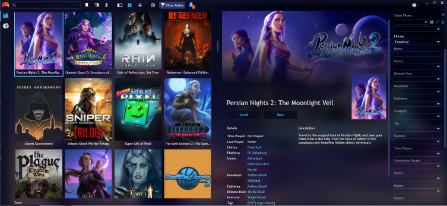
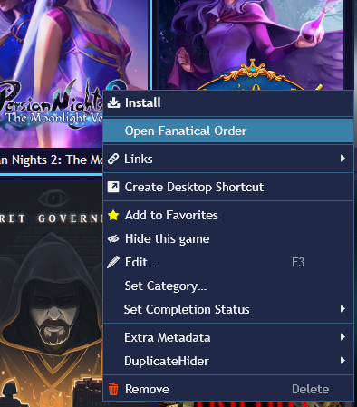
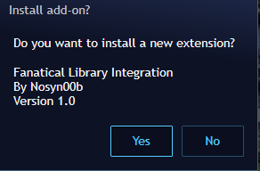
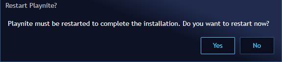
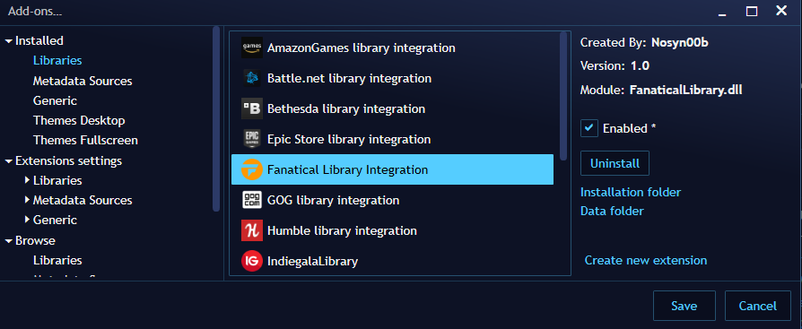
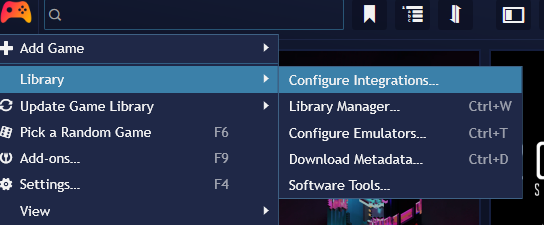
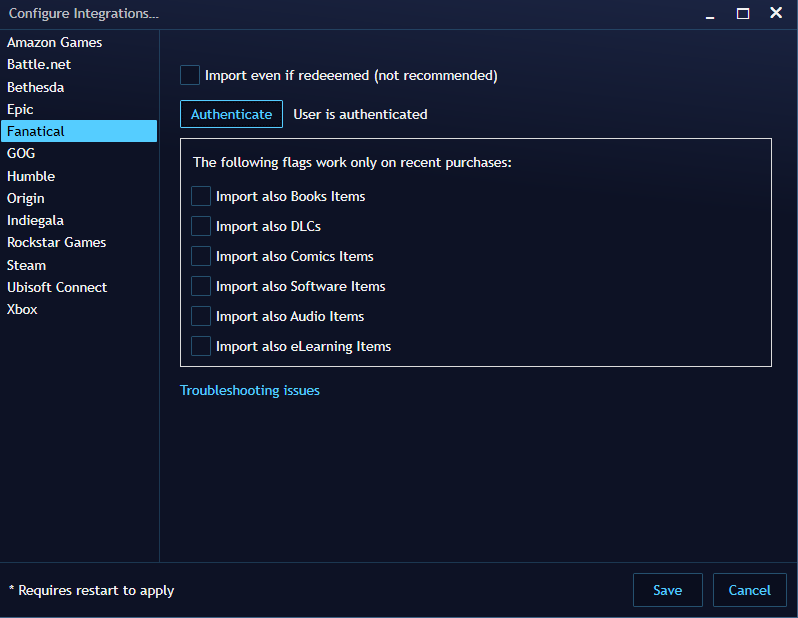
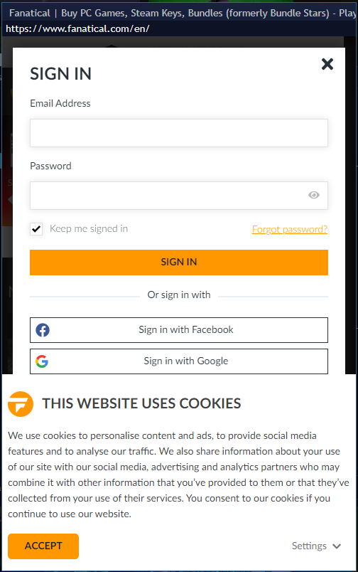
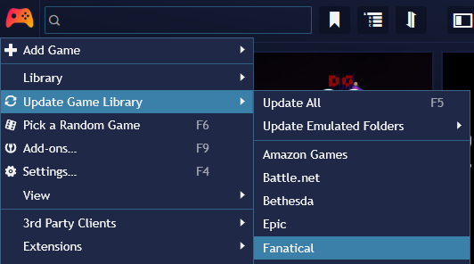
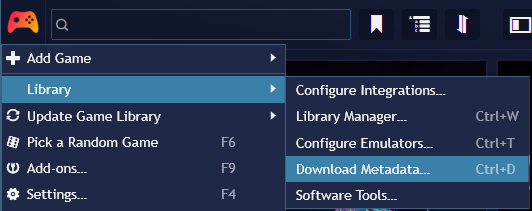

# playnite-fanatical-plugin
Fanatical Plugin integration for Playnite

## Overview
This plugin was written to let you see in the Playnite UI all those owned-but-not-redeemed games that you purchased from Fanatical.

## Features

- See all your (still non-redeemed) games purchased with your existing Fanatical account, as it happens for all your games registered on the varius platforms/stores when they are integrated with Playnite via similar plugins.

- Open in external browser the Order corresponding to a purchased game with Fanatical.

- Experimentally
You can also import the already redemed games, and non-games (Audio, Video...).

Due to the nature of Fanatical Store, this integration does not support tags, startig and installing games, "game time" and other amenities, it just lists owned games.

Refreshing (adding) games happens as often as for the other Playnite libraries.

Currently not supported:
- Removal of games no more in Fanatical.
- Parametric refresh time

# Installation 

Installation of the plugin is an easy (standard) procedure, because Playnite supports ad hoc file extensions. The process consists in the following steps:

- Download the release from github (FanaticalLibraryPlugin_XXX.pext)
- Install it by clicking on the file withing windows file explorer (or similar for mac)

After clicking the *.pext file  you will see the following dialog appearing in Playnite:

Playnite will ask to restart:

After restart you will see the plug-in via the add-on menu (it will be automatically enabled)

If a "Fanatical Library Integration" is present in the libraries list, you made it! Please note that the plugin status is still disconnected and the list of the games not updated so you will se no new games imported at this point (see next section to make your first connection).

# Accessing your Fanatical Account

To import the Fanatical games in the Playnite DB, the plugin needs to have access to you account. 

To do so you have to open the extension settings dialog: you can click _Extensions Settings->Libraries_ list on the Add-ons dialog (see previous screenshot) and select _Fanatical_, or you can also access it in the classical way via the Playnite menu: 

If you're still not authenticated (as it happens the first time you use the plugin), it will be written so just to the right of the _Authenticate_ button. You can re-authenticate even if you are already authenticated (in this case your previous authentication will be invalidated).

If it's the first time you use the plugin, it is recommended to leave all other settings alone, you can always come back to this dialog and change what you want in a second time.

Click the _Authenticate_ button and the internal browser will pop up. Please wait a bit because tha Fanatical page can take some time to load all the resources. After a while the Fanatical login dialog will automatically pop-up:

Check the "Keep me singed in" flag, and then proceed normally through all the steps of authentication (also Google and facebook authentication should work if you registered in that way). If the login is succesfull, you will get to the standard _"Welcome back"_ message. Do nothing  and after some seconds the browser window will close automatically (some unattended navigation on other fanatical pages can happen before automatic closure).

If the connection was successfull, check the new status of the plugin: written just to the right of the _Authenticate_ button. _"User is authenticated"_ should appear.

You can now close the settings dialog an go for you first games import.

Normally, after the first successfully completed login, another authenticaton will not be needed, because the Fanatical Plugin will remember your authenticated session (as a normal browser would do). The plugin will never store your username and password.

# Updating the game list

To ask Playnite to get the list of all your owned and unredeemed games (or in any case all the games as filtered in you settings) you simply have to use the 

The list of games of each integrated library is reloaded any time you open Playnite, so possible new games will be added consequently. 

Getting the list of games will be quite fast, but importing all their cover image and metadata will take its time, so Playnite will do that asynchronously (using the standard Metadata downloader).

If, for some reason, the metadata download is interrupted you can alwais restart that via the dedicated menu:

# Troubleshooting

- If,  for some reason, you close the sign in dialog, you are stucked with the opened embedded browser window. To close it simply navigate to on another page. You can also re-open the sign in dialog e retry.

# Issue reporting
I wrote this plugin during my scarce free time (usally at night): no support is granted but you can try :)

Along with your detailed problem description, you may need to attach plugin log files located at the same level of the Playnite executables (note the plugin!).

The right log files are named:
- extensions.log
- playnite.log

